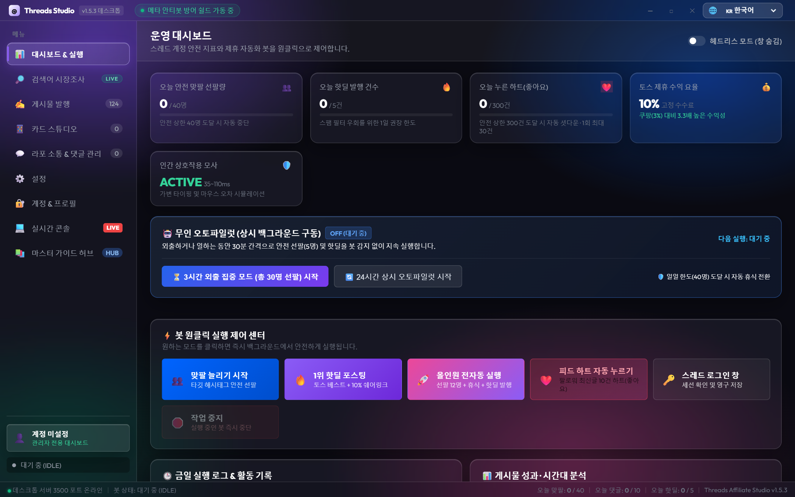
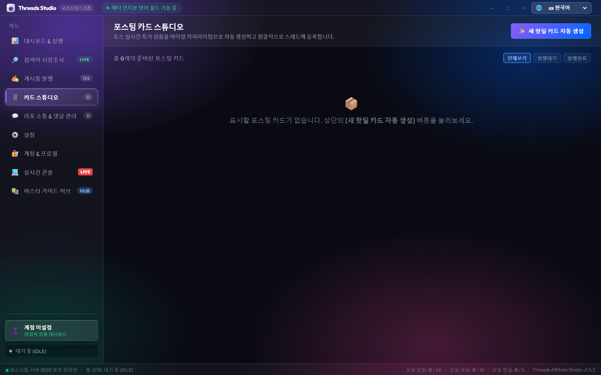
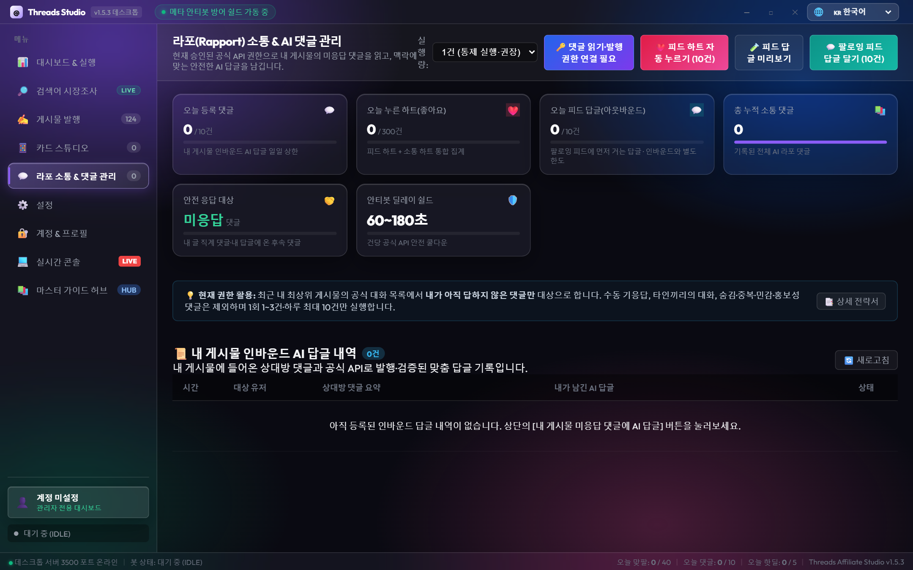
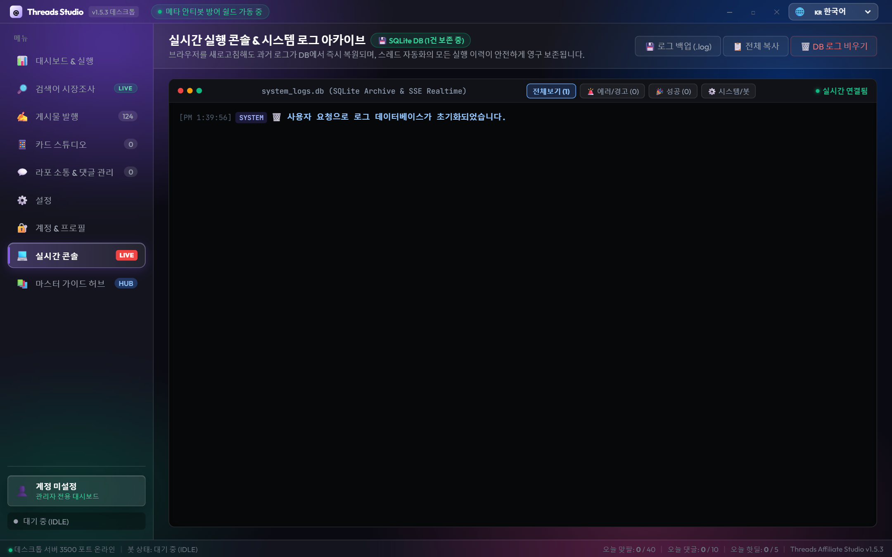

# 🚀 Threads アフィリエイト自動化プラットフォーム

AIを活用したThreads(スレッズ)アフィリエイトマーケティング＆オーガニック交流（ラポール形成）オールインワン自動化プラットフォームです。

---

### 🌐 言語 / Languages
[ 🇰🇷 한국어 ](../../README.md) | [ 🇺🇸 English ](README_en.md) | [ 🇯🇵 日本語 ] | [ 🇨🇳 简体中文 ](README_zh.md) | [ 🇪🇸 Español ](README_es.md) | [ 🇩🇪 Deutsch ](README_de.md) | [ 🇫🇷 Français ](README_fr.md) | [ 🇧🇷 Português ](README_pt.md)

---

## 📸 ダッシュボード プレビュー

<div align="center">
  <h3>📊 1. メインダッシュボード＆活動統計概要</h3>
  
  <p><em>日次安全クォータ、活動統計、ボット即時制御、リアルタイムSSEログストリーミング</em></p>
  <br />

  <h3>📱 2. 投稿カードスタジオ</h3>
  
  <p><em>人気商品の自動収集、AIによるフックコピー生成、4:5最適化ビジュアルカードレンダリング</em></p>
  <br />

  <h3>💬 3. フィード交流＆AI共感コメント管理</h3>
  
  <p><em>リアルタイム感情分析、文脈に応じた共感コメント自動生成、ワンクリック一括交流</em></p>
  <br />

  <h3>💻 4. リアルタイムシステムコンソール</h3>
  
  <p><em>バックグラウンドジョブ、ブラウザセッション状態、APIコールのリアルタイム監視</em></p>
</div>

---

## 📌 主な機能

1. **💬 交流＆AIコメントエンジン (`scripts/rapport_engine.mjs`)**:
   - SNS固有の略語やカジュアルな会話トーンを完璧に理解。
   - 3つのスタイル（深い共感型、機知に富んだ会話型、温かい癒やし型）を自動生成。
   - キーワードのリアルタイム抽出と安全な自動交流パイプライン。

2. **📦 30日100選キラーコンテンツ保管庫 (`content_vault.json`)**:
   - 初期アカウントの信頼性向上とフォロワー獲得のための厳選コンテンツプリセット。
   - 生活の知恵(25件)、共感ライフスタイル(25件)、二者択一投票(25件)、本音トーク(25件)。

3. **🖥️ グラスモーフィズム デスクトップ風Webダッシュボード (`http://localhost:3500`)**:
   - 半透明ガラス質感の洗練されたダークテーマUI。
   - **8ヶ国語リアルタイム自動翻訳(i18n)**: ブラウザ言語自動検出＆ワンクリック切り替え。
   - 6大画面: ダッシュボード、カードスタジオ、交流管理、アカウント、設定、コンソール。

4. **🛡️ アンチボット保護シールド＆人間型タイピングエミュレーション**:
   - 厳格な日次安全クォータ（1日40フォロー、30コメント制限）。
   - 人間のような可変タイピング速度（35〜110ms）とランダムクールダウン。

5. **🔥 アフィリエイト商品投稿＆公式Graph API対応**:
   - トレンド商品の自動収集と成果報酬リンク発行。
   - Meta公式Threads Graph APIおよびPlaywright Chromeセッションのハイブリッド対応。

---

## 🚀 クイックスタート

### 1. 必要要件
- Node.js 18以上
- Google Chrome ブラウザ

### 2. インストール
```bash
git clone https://github.com/nerin81-netizen/threads-affiliate-automation.git
cd threads-affiliate-automation
npm install
```

### 3. 環境変数の設定
```bash
cp .env.example .env
```

### 4. 実行
```bash
npm start
# または start_dashboard.bat をダブルクリック
```
ブラウザで `http://localhost:3500` にアクセスします。（ブラウザの言語設定に応じて日本語に自動翻訳されます）

---

## 📄 ライセンス
本プロジェクトは [MIT License](../../LICENSE) の下で公開されています。

---

## ⚖️ 免責事項 (Legal Disclaimer)
- 本プロジェクトは、Meta Platforms, Inc.(Threads, Instagram)、Viva Republica(Toss)等と公式な提携関係のない独立したオープンソース研究・開発プロジェクトです。
- 本ソフトウェアは教育・研究目的で提供されており、各プラットフォームの利用規約を遵守する責任は利用者に帰属します。
